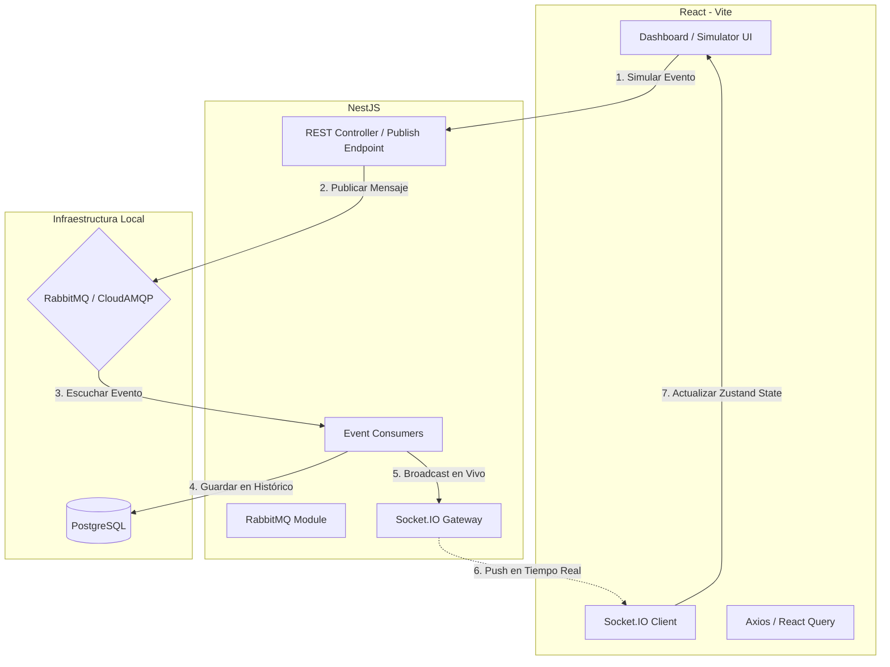

# 🤖 Guía para Agentes de IA - EventBoard

Este archivo define las directrices arquitectónicas, estándares de codificación y flujos de trabajo para cualquier agente de IA que colabore en el desarrollo de **EventBoard**.

---

## 🏗️ Arquitectura del Sistema

El proyecto sigue una **Arquitectura Orientada a Eventos (Event-Driven Architecture - EDA)** de tipo monorepo para facilitar el desarrollo local.



---

## 📁 Estructura de Directorios Esperada

```text
EventBoard/
├── backend/
│   ├── src/
│   │   ├── auth/            # Módulo de Autenticación (JWT + bcrypt)
│   │   ├── users/           # Módulo de Gestión de Usuarios
│   │   ├── events/          # Producción de eventos (Endpoints de simulación)
│   │   ├── amqp/            # Conector de RabbitMQ (Producers/Consumers)
│   │   ├── event-store/     # Guardado de logs históricos en Postgres
│   │   ├── notifications/   # Consumidor de alertas y registro de notificaciones
│   │   ├── websocket/       # Gateway de Socket.IO
│   │   ├── main.ts          # Inicialización y Swagger
│   │   └── app.module.ts    # Módulo raíz
│   ├── prisma/
│   │   └── schema.prisma    # Esquema de base de datos
│   ├── .env.example         # Plantilla de variables de entorno backend
│   └── package.json
├── frontend/
│   ├── src/
│   │   ├── assets/          # Estilos e imágenes
│   │   ├── components/      # UI Reutilizable (Botones, tablas, inputs, charts)
│   │   ├── hooks/           # Custom hooks (Sockets, Query, etc.)
│   │   ├── pages/           # Vistas (Login, Dashboard, EventList, Simulator)
│   │   ├── services/        # Clientes API (Axios, endpoints)
│   │   ├── store/           # Zustand stores (auth, events)
│   │   ├── App.tsx          # Configuración de Router y Temas
│   │   └── main.tsx         # Punto de entrada de React
│   ├── .env.example         # Plantilla de variables de entorno frontend
│   └── package.json
└── README.md                # Instrucciones de configuración para humanos
```

---

## 🛠️ Directrices de Desarrollo (Reglas del Backend)

### 1. Base de Datos (Prisma ORM)
*   **Convención de Nombres:** Modelos en `PascalCase` y tablas en `snake_case` usando la directiva `@@map`.
*   **Tipos de Eventos:** Mantener consistencia en la nomenclatura de tipos de eventos: `[ENTIDAD]_[ACCION]`. Ejemplo: `USER_CREATED`, `DOCUMENT_APPROVED`, `SYSTEM_ALERT_CRITICAL`.
*   **Esquema Base Propuesto:**
    ```prisma
    model User {
      id        String   @id @default(uuid())
      email     String   @unique
      password  String
      name      String
      role      Role     @default(USER)
      createdAt DateTime @default(now()) @map("created_at")

      @@map("users")
    }

    model EventLog {
      id           String   @id @default(uuid())
      type         String
      sourceModule String   @map("source_module")
      payload      Json
      userId       String?  @map("user_id")
      severity     Severity @default(INFO)
      createdAt    DateTime @default(now()) @map("created_at")

      @@map("event_logs")
    }

    enum Role {
      USER
      ADMIN
      PRODUCER
    }

    enum Severity {
      INFO
      WARNING
      CRITICAL
    }
    ```

### 2. RabbitMQ & Event Bus
*   **Fallback local:** Si el backend no puede conectarse a la URL de RabbitMQ en el arranque, debe capturar el error y activar un `LocalEventEmitter` (utilizando `@nestjs/event-emitter`) como fallback automático. **Esto garantiza que el proyecto sea ejecutable localmente sin infraestructura previa de mensajería.**
*   **Decoradores:** Usar patrones claros para los consumidores:
    *   Ejemplo si usas `@golevelup/nestjs-rabbitmq`:
      ```typescript
      @RabbitSubscribe({
        exchange: 'eventboard-exchange',
        routingKey: 'events.*',
        queue: 'event-store-queue',
      })
      async handleEvent(msg: Record<string, any>) {
        // Lógica de consumo
      }
      ```

### 3. Swagger
*   Todos los controladores deben estar documentados con decoradores `@ApiTags`, `@ApiOperation`, `@ApiResponse`, etc.

---

## 🎨 Directrices de Desarrollo (Reglas del Frontend)

### 1. Diseño y Estética (Requisito Crítico)
*   **Estilo Premium:** Evitar colores planos. Usar fondos oscuros profundos (`bg-slate-950` / `bg-slate-900`), acentos elegantes con gradientes (`from-indigo-500 via-purple-500 to-pink-500`), bordes semi-transparentes (`border-white/10`) y efectos de desenfoque (`backdrop-blur-md`).
*   **Interactividad:** Cada botón, tarjeta o fila de tabla debe tener transiciones suaves (`transition-all duration-200`) y efectos `hover` atractivos.
*   **Visualización de Eventos:** Los eventos deben ingresar al Dashboard con animaciones de tipo fade-in o slide-in (se puede lograr fácilmente con Tailwind y transiciones de estado simples o librerías ligeras).

### 2. Gestión de Estado (Zustand)
*   Mantener almacenes independientes para la sesión (`useAuthStore`) y los eventos en tiempo real (`useEventStore`).
*   No contaminar los componentes con variables globales innecesarias; extraer solo lo necesario (`const user = useAuthStore(state => state.user)`).

### 3. Sockets en el Frontend
*   Instanciar el cliente de Socket.IO en un archivo de configuración (`src/services/socket.ts`) o a través de un Custom Hook para evitar múltiples conexiones duplicadas.
*   El hook debe suscribirse a los eventos del WebSocket al montarse el Dashboard y limpiar las suscripciones al desmontarse.

---

## 🤖 Directrices de Colaboración para la IA

Si estás modificando código existente, debes seguir estas reglas estrictamente:
1.  **Integridad de Documentación:** Nunca borres comentarios, JSDocs o tipados complejos existentes a menos que estén desactualizados.
2.  **Validaciones estrictas:** Toda entrada en la API debe validarse mediante `class-validator` y `class-transformer` en el backend, y mediante `zod` en el frontend.
3.  **No usar CD ni Docker:** No propongas dockerizar servicios ni desplegar en VPS de pago. La arquitectura está optimizada para que un estudiante la ejecute localmente con `npm install` y `npm run dev`.
4.  **Generación de Datos de Prueba:** Al implementar el backend, es una buena práctica incluir un script de seed (`prisma/seed.ts`) que inserte un usuario administrador por defecto (`admin@eventboard.com` / `admin123`) para que la prueba inicial del sistema sea instantánea.
